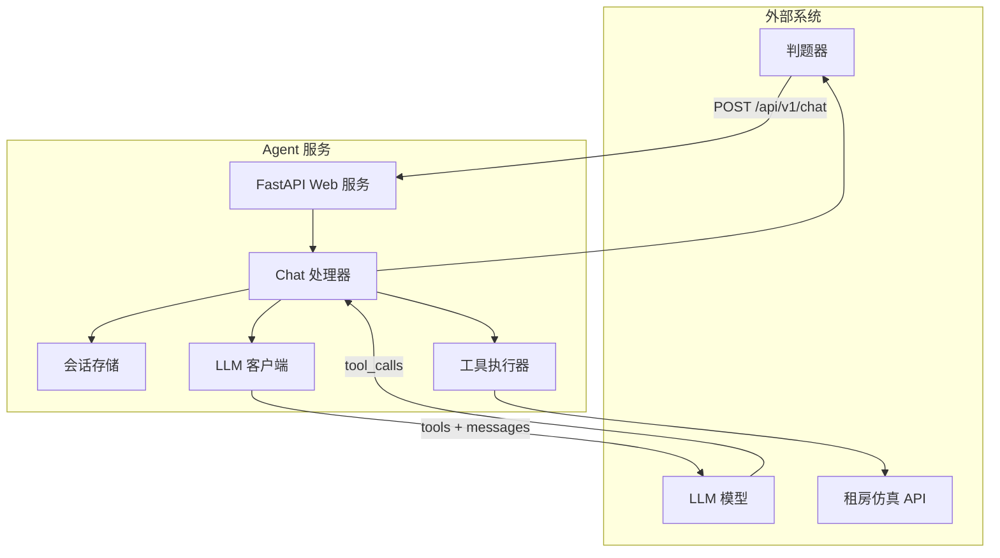
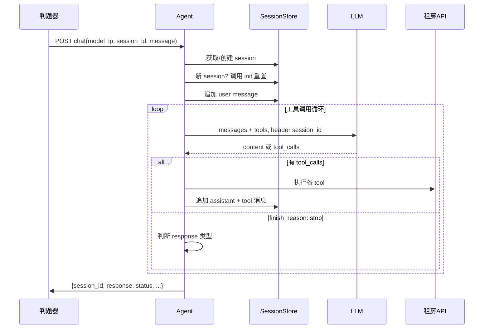

# 租房 AI Agent 开发计划

## 一、架构概览




## 二、核心模块设计

### 2.1 项目结构

```
rent_agent_tool/
├── pyproject.toml / requirements.txt
├── config.py              # 配置（含 X-User-ID 默认 f00952481）
├── main.py                # FastAPI 入口，监听 8190
├── api/
│   └── chat.py            # POST /api/v1/chat 路由
├── agent/
│   ├── handler.py         # 对话处理主逻辑（LLM 调用 + 工具循环）
│   ├── session.py         # 会话管理（按 session_id 存储消息历史）
│   └── llm_client.py      # LLM 客户端（OpenAI 兼容）
├── tools/
│   ├── definitions.py     # 将租房 API 转为 OpenAI tools 格式
│   ├── executor.py        # 工具执行器（含 X-User-ID、init 重置）
│   └── rent_api.py        # 租房 API HTTP 调用封装
└── .env.example
```

### 2.2 关键实现要点


| 需求点            | 实现方式                                                                                    |
| -------------- | --------------------------------------------------------------------------------------- |
| 监听端口 8190      | FastAPI 绑定 `0.0.0.0:8190`                                                               |
| 多轮对话           | 按 `session_id` 维护 `messages` 列表，每次请求追加并传给 LLM                                           |
| 新 session 数据重置 | 新 `session_id` 首次请求时调用 `POST /api/houses/init`                                          |
| X-User-ID      | 配置文件/环境变量，默认 `f00952481`，所有 `/api/houses/*` 请求必带                                        |
| 工具定义           | 将 [租房API接口.json](租房API接口.json) 的 OpenAPI 转为 OpenAI `tools` 格式（JSON Schema）              |
| 工具循环           | LLM 返回 `tool_calls` → 执行工具 → 将结果作为 `tool` role 消息追加 → 再次调用 LLM，直至 `finish_reason: stop` |
| 房源查询响应         | `response` 为 JSON 字符串：`{"message": "...", "houses": ["HF_xxx", ...]}`，最多 5 套            |
| 租房操作           | 用户明确要租时，调用 `POST /api/houses/{id}/rent`，不能仅文本回复                                         |


### 2.3 Tools 转换规则

将 OpenAPI 3.0 的 `paths` 转为 OpenAI `tools` 数组，每个接口一个 tool：

```python
# 示例：get_houses_by_platform
{
  "type": "function",
  "function": {
    "name": "get_houses_by_platform",
    "description": "查询可租房源，支持行政区、价格、户型、地铁距离等筛选...",
    "parameters": {
      "type": "object",
      "properties": {
        "district": {"type": "string", "description": "行政区，逗号分隔"},
        "min_price": {"type": "integer", "description": "最低月租金"},
        "max_subway_dist": {"type": "integer", "description": "最大地铁距离(米)，近地铁建议800"},
        "sort_by": {"type": "string", "enum": ["price", "area", "subway"], "description": "排序字段"},
        "sort_order": {"type": "string", "enum": ["asc", "desc"]},
        ...
      }
    }
  }
}
```

需覆盖的接口：地标 1-5、房源 6-15（含 rent/terminate/offline）。注意 `by_platform` 的 `sort_by` 使用 `subway` 表示按地铁距离排序。

### 2.4 会话与工具循环流程




### 2.5 响应格式处理

- **普通对话**：`response` 为自然语言字符串。
- **房源查询完成**：`response` 为 JSON 字符串，需满足：
  - 包含 `message` 和 `houses` 字段；
  - `houses` 为房源 ID 列表，最多 5 个；
  - 无自然语言前缀，必须是合法 JSON。

通过 LLM 的 system prompt 约束输出格式，并在代码中校验/修正。

### 2.6 配置项


| 配置项           | 说明                    | 默认值                                                  |
| ------------- | --------------------- | ---------------------------------------------------- |
| RENT_USER_ID  | 比赛平台用户工号，用于 X-User-ID | f00952481                                            |
| RENT_API_BASE | 租房 API 地址             | [http://7.225.29.223:8080](http://7.225.29.223:8080) |
| AGENT_PORT    | Agent 监听端口            | 8190                                                 |
| LLM_PORT      | LLM 端口（固定）            | 8888                                                 |


## 三、实现步骤

### 步骤 1：项目初始化

- 使用 `uv venv` 创建虚拟环境；
- 创建 `pyproject.toml`，依赖：`fastapi`、`uvicorn`、`httpx`、`pydantic-settings`；
- 创建 `config.py` 和 `.env.example`。

### 步骤 2：租房 API 封装

- 实现 `rent_api.py`：封装所有 15 个接口的 HTTP 调用；
- 房源接口统一添加 `X-User-ID` 请求头；
- 实现 `init` 重置接口调用。

### 步骤 3：Tools 定义

- 解析 [租房API接口.json](租房API接口.json)，生成 OpenAI `tools` 数组；
- 确保 `name`、`description`、`parameters`（JSON Schema）完整准确；
- 对「近地铁」「按地铁距离排序」等场景在 description 中明确说明（如 max_subway_dist: 800）。

### 步骤 4：工具执行器

- 实现 `executor.py`：根据 `tool_calls` 的 name 和 arguments 调用对应 rent_api 方法；
- 将 API 返回序列化为字符串，作为 tool 消息的 `content` 传给 LLM。

### 步骤 5：LLM 客户端

- 实现 `llm_client.py`：请求 `http://{model_ip}:8888/v1/chat/completions`；
- 请求头带 `session_id`；
- 支持 `messages`、`tools`、`stream: false`。

### 步骤 6：会话管理

- 实现 `session.py`：内存字典 `session_id -> messages`；
- 新 session 时调用 init 重置；
- 支持追加 user、assistant、tool 消息。

### 步骤 7：Chat 主流程

- 实现 `handler.py`：接收 message → 追加到 session → 循环调用 LLM；
- 若有 `tool_calls`：执行工具 → 追加 tool 消息 → 继续调用 LLM；
- 若无 `tool_calls`：根据 content 判断是普通回复还是房源 JSON，构造最终 `response`。

### 步骤 8：FastAPI 路由

- 实现 `POST /api/v1/chat`，解析 `model_ip`、`session_id`、`message`；
- 调用 handler，返回 `{session_id, response, status, tool_results, timestamp, duration_ms}`。

### 步骤 9：System Prompt 设计

- 明确 Agent 角色：租房助手；
- 说明何时调用哪些工具、如何组合多条件查询；
- 约束房源查询完成时的输出格式：`{"message": "...", "houses": [...]}`，最多 5 套；
- 强调「租房」必须调用 rent 接口，不能仅文本回复。

### 步骤 10：联调与测试

- 本地启动 Agent，用 curl 模拟判题器请求；
- 覆盖：聊天、单条件查询、多条件查询、多轮对话、租房操作；
- 校验 response 格式和 houses 数量。

### 步骤 11：增强功能实现（比赛优化）

- **日志**：集成 `structlog`/`loguru`，在 chat 路由、LLM 客户端、rent_api 中埋点，输出到 `logs/`；
- **Trace 导出**：在 handler 完成时，将 session 完整数据写入 `logs/traces/`；
- **Response 校验**：在返回前对房源类 response 做 JSON 校验与修正；
- **本地测试**：实现 `run_tests.py`，从 fixtures 读取用例并调用 Agent 校验；
- **重试**：在 rent_api、llm_client 中为可重试错误添加重试逻辑；
- **并行工具**：executor 对多 tool_calls 使用 `asyncio.gather` 并行执行。

## 四、注意事项

1. **sort_by 字段**：API 的 `sort_by` 为 `price`/`area`/`subway`，用例期望 `subway_distance`，实际传 `subway` 即可。
2. **近地铁定义**：`max_subway_dist: 800` 表示 800 米内，1000 米内为地铁可达。
3. **租房必调 API**：用户说「就租这套」时，必须调用 `rent` 接口，否则判题不通过。
4. **listing_platform**：rent/terminate/offline 需传平台，可从房源详情或上下文推断，默认可用「安居客」。

## 五、提升比赛成绩的增强功能

在基础功能之上，增加以下能力以支持**持续迭代**和**基于得分优化**：

### 5.1 全链路日志记录


| 记录对象   | 记录内容                                               | 用途                          |
| ------ | -------------------------------------------------- | --------------------------- |
| 判题器接口  | 请求体（model_ip, session_id, message）、响应体、耗时          | 复现判题输入，定位判题失败原因             |
| LLM 接口 | 请求（messages、tools）、响应（content、tool_calls、usage）、耗时 | 分析 LLM 决策、token 消耗、工具选择是否正确 |
| 租房 API | 请求（URL、方法、params、headers）、响应（status、body 摘要）、耗时    | 核对 API 参数、排查接口异常            |


**实现方式**：

- 使用 `structlog` 或 `loguru` 结构化日志；
- 日志目录 `logs/`，按日期分文件：`logs/agent_{date}.log`；
- 每条记录包含 `session_id`、`request_id`（UUID），便于按会话追踪；
- 支持 `LOG_LEVEL` 配置（DEBUG/INFO），生产可设为 INFO 减少体积。

### 5.2 会话级 Trace 导出

- 每个请求结束后，将完整 trace 写入 `logs/traces/{session_id}_{timestamp}.json`；
- Trace 内容：输入 message、完整 messages 历史、每轮 LLM 请求/响应、每次工具调用及结果、最终 response；
- 用途：提交后若某用例失败，可根据 session_id 找到 trace，本地复现并调试。

### 5.3 本地测试用例运行器

- 新增 `scripts/run_tests.py`，读取用例文件（JSON，格式与需求中的用例示例一致）；
- 模拟判题器：对每个 round 发送 POST 到本地 Agent，校验 `response` 与 `expected`；
- 校验规则：`message_contains` 子串匹配、`expectedHouses` 集合相等（顺序可忽略）；
- 输出：每个用例通过/失败、失败时打印 diff；
- 用途：提交前本地跑通用例，减少无效提交。

### 5.4 Response 校验与自动修正

- 在返回判题器前，对「房源查询」类 response 做校验；
- 校验：是否为合法 JSON、是否包含 `message` 和 `houses`、`houses` 是否为数组且长度 ≤ 5；
- 自动修正：若 LLM 输出带自然语言前缀（如「为您找到以下房源：」+ JSON），用正则提取 JSON 部分；
- 若修正失败，记录 WARNING 并返回原始内容，便于从日志发现 prompt 问题。

### 5.5 指标统计与上报（可选）

- 每次请求记录：LLM 调用次数、工具调用次数、总耗时、token 使用量；
- 可写入 `logs/metrics_{date}.jsonl`，每行一条 JSON；
- 用途：分析多轮对话的轮次分布，优化 prompt 减少无效调用。

### 5.6 并行工具调用

- LLM 可能一次返回多个 `tool_calls`（如同时查海淀和朝阳）；
- 工具执行器支持并行执行无依赖的 tool_calls，缩短总耗时；
- 用途：提升多条件查询场景的响应速度，可能影响超时类用例。

### 5.7 错误处理与重试

- 租房 API 调用失败时：记录完整错误，对 5xx/网络超时做有限次重试（如 2 次）；
- LLM 调用失败时：重试 1 次，若仍失败则返回友好错误信息，避免判题器收到 500；
- 用途：提高稳定性，减少因偶发网络问题导致的扣分。

### 5.8 配置与运行模式


| 配置项                 | 说明            | 默认值         |
| ------------------- | ------------- | ----------- |
| LOG_LEVEL           | 日志级别          | INFO        |
| ENABLE_TRACE_EXPORT | 是否导出 trace 文件 | true        |
| ENABLE_RETRY        | 是否启用 API 重试   | true        |
| TRACE_DIR           | Trace 文件目录    | logs/traces |


---

## 六、项目结构（更新后）

```
rent_agent_tool/
├── pyproject.toml
├── config.py
├── main.py
├── api/
│   └── chat.py
├── agent/
│   ├── handler.py
│   ├── session.py
│   └── llm_client.py
├── tools/
│   ├── definitions.py
│   ├── executor.py
│   └── rent_api.py
├── logging_conf.py         # 日志配置，统一入口
├── scripts/
│   └── run_tests.py        # 本地测试运行器
├── tests/
│   └── fixtures/           # 用例 JSON（可从需求文档提取）
│       └── sample_cases.json
├── logs/                   # 运行时生成
│   ├── agent_*.log
│   └── traces/
├── .env.example
└── README.md
```

---

## 七、交付物

- 可运行的 Agent 服务（`uv run uvicorn main:app --host 0.0.0.0 --port 8190`）；
- 配置文件与 `.env.example`；
- 全链路日志与 Trace 导出；
- 本地测试运行器 `scripts/run_tests.py`；
- README（启动方式、配置说明、本地测试方法、日志与 Trace 使用说明）。

