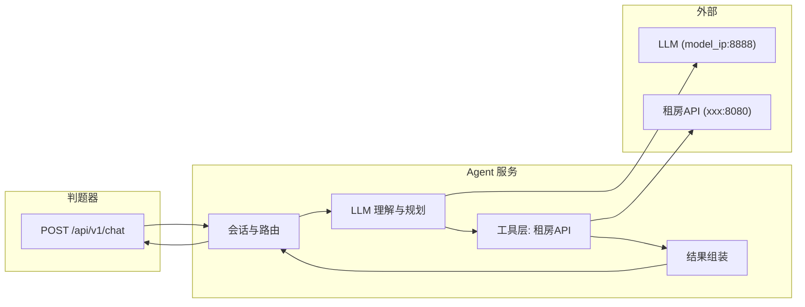

# 租房 AI Agent 赛题解析与解题思路

## 一、赛题本质

- **目标**：实现一个本地 Web 服务（`http://localhost:8191`），作为「租房 Agent」。
- **输入**：判题器每次 POST `model_ip`、`session_id`、`message` 到 `/api/v1/chat`。
- **输出**：判题器只根据响应体里的 `**response`** 字段评分；其余字段（session_id、status、tool_results、timestamp、duration_ms）为约定结构，不参与评分逻辑。
- **数据流**：Agent 用 `model_ip:8888` 调 LLM 理解/规划 → 按需调租房仿真 API（地标 + 房源）→ 汇总后返回 `response`（普通对话为自然语言；完成房源查询时为 **JSON 字符串**，且必须含 `message` + `houses`）。

因此，赛题 = **「需求理解 + 多轮会话 + 工具调用（租房 API）+ 结构化输出」** 的 Agent 实现与接口规范遵守。Agent 必须具备**上下文管理能力**：对同一 `session_id` 的多轮会话存储上下文记忆，并基于记忆内容调用 LLM 和租房 API。

---

## 二、评分维度与用例类型（来自需求说明）

| 类型       | 常量     | 积分      | 考察点                     |
| -------- | ------ | ------- | ----------------------- |
| 聊天类      | Chat   | 5 分     | 基础对话，无查房                |
| 单轮对话简单任务 | Single | 10–15 分 | 单条件/多条件查房，一次说清需求        |
| 多轮对话复杂任务 | Multi  | 20–30 分 | 多轮追问、多房源对比、边聊边查并执行租房/退租 |

**评分要点**：

- **普通对话**：`response` 为自然语言，无格式要求。
- **房源查询完成后**：`response` 必须是 **合法 JSON 字符串**（可被 `JSON.parse`），且包含：
  - `message`：给用户的说明；
  - `houses`：房源 ID 数组，**最多 5 个**。
- 判题会检查 `message_contains`（关键词/逻辑）和 `expectedHouses`（ID 及顺序）；用户说「就租最近的那套」时，必须**真实调用** `POST /api/houses/{house_id}/rent`，不能只在回复里写「已租」。

**判分依据（用例 expected，详见需求说明 5. 用例说明）**：

判题器根据用例中的 `expected` 判分，需同时满足：

- **message_contains**：`response` 解析出的 `message` 字段必须**包含** expected 中列出的每一个子串（判题器做子串匹配）；
- **expectedHouses**：`houses` 数组必须与 expected 中列表**完全一致**（元素及顺序均需匹配）。

---

## 三、关键约束（易丢分点）

1. **上下文管理与数据隔离**
  - Agent 必须具备**上下文管理能力**：同一 `session_id` 的多轮对话共享**上下文记忆**（历史消息/已查房源/用户偏好），基于记忆调用 LLM 和租房 API。
  - **每新起一个 session**：先调用 `**POST /api/houses/init`**（请求头 `X-User-ID: 真实工号`），再做后续请求，否则状态被上一用例污染会导致失败。
2. **租房 API 使用**
  - 所有 `/api/houses/`* 请求必须带 `**X-User-ID`**（比赛平台注册工号），否则 400。
  - 地标接口 `/api/landmarks/`* 不需 `X-User-ID`。
  - 「近地铁」：需求中 800m 以内为近地铁，1000m 以内为地铁可达；查房时用 `max_subway_dist`（如 800/1000）。
  - 地标附近房源用接口 **nearby**，参数 `max_distance` 默认 2000（米）；小区周边商超/公园用 **nearby_landmarks**，`max_distance_m` 默认 3000。
3. **输出格式**
  - 如果没有完成房源查询，返回自然语言文本
  - 如果完成房源查询，返回房源结果：`response` 必须是 **字符串**，内容为 JSON，例如：  
   `"{\"message\": \"...\", \"houses\": [\"HF_4\", \"HF_6\"]}"`  。JSON不能带自然语言前缀，否则解析失败。
4. **多平台与操作**
  - 房源有链家/安居客/58同城；租房/退租/下架时 `listing_platform` 必填，且需调用对应 POST 接口，仅文本里写「已租」无效。

---

## 三（附）、用例判分分析与高分保障

基于需求说明用例示例，判题器用 `expected.message_contains` 与 `expected.expectedHouses` 判分。当前方案需补充以下要点方能得高分。

### 用例 1（EV-43）：无结果场景

| 输入                                 | expected                                    | 保障要点                                                                                                                |
| ---------------------------------- | ------------------------------------------- | ------------------------------------------------------------------------------------------------------------------- |
| 东城区精装两居，租金 5000 以内，离地铁 500 米以内的有吗？ | message_contains: ["没有"]；expectedHouses: [] | 查房 API 返回空或不符合时，**必须**返回 `response` 为 JSON 字符串，`message` 含「没有」（如「没有找到符合条件的房源」），`houses` 为 `[]`。不能返回自然语言或 houses 非空。 |

### 用例 2（EV-46）：多轮 + 翻页无更多

| 轮次  | 输入                       | expected                                                                              | 保障要点                                                                                                                                                                                                   |
| --- | ------------------------ | ------------------------------------------------------------------------------------- | ------------------------------------------------------------------------------------------------------------------------------------------------------------------------------------------------------ |
| 1   | 西城区离地铁近的一居室有吗？按离地铁从近到远排。 | message_contains: ["西城","1","1000","subway_distance","asc"]；expectedHouses: ["HF_13"] | API 参数：district=西城、bedrooms=1、max_subway_dist=**1000**（一居「近地铁」用例用 1000 米）、sort_by=subway、sort_order=asc。**message 必须包含** 西城、1、1000、subway_distance、asc 等关键词，可由 LLM 生成或模板填充。houses 顺序与 API 返回一致，取前 5 条。 |
| 2   | 还有其他的吗？把所有符合条件的都给出来      | message_contains: ["没有其他的了，只有这一套"]；expectedHouses: ["HF_13"]                          | 从记忆取上一轮条件，用 page=2 翻页；若 API 返回空或仅 1 条，则 message **必须包含**「没有其他的了，只有这一套」（建议原文或高度一致表述），houses 为 ["HF_13"]。                                                                                                |

### 用例 3（EV-45）：多轮 + 租房

| 轮次  | 输入                        | expected                                                                                                                   | 保障要点                                                                                                                                                                                                                     |
| --- | ------------------------- | -------------------------------------------------------------------------------------------------------------------------- | ------------------------------------------------------------------------------------------------------------------------------------------------------------------------------------------------------------------------ |
| 1   | 海淀区离地铁近的两居有吗？按离地铁从近到远排一下。 | message_contains: ["海淀","2","800","subway_distance","asc"]；expectedHouses: ["HF_906","HF_1586","HF_1876","HF_706","HF_33"] | API 参数：district=海淀、bedrooms=2、max_subway_dist=**800**（两居「近地铁」用 800 米）、sort_by=subway、sort_order=asc。**message 必须包含** 海淀、2、800、subway_distance、asc。houses **顺序必须**为 ["HF_906","HF_1586","HF_1876","HF_706","HF_33"]，不可乱序。 |
| 2   | 就租最近的那套吧。                 | message_contains: ["好的"]；expectedHouses: ["HF_906"]                                                                        | 从记忆取上一轮候选列表**第一条** HF_906，调用 `POST /api/houses/HF_906/rent?listing_platform=安居客`；返回 JSON，message 含「好的」，houses 为 ["HF_906"]。                                                                                              |

### 高分保障实现要点

1. **message 满足 message_contains**：在生成 message 时，通过 prompt 要求 LLM 在回复中**显式包含**查询条件关键词（区域、户型、地铁距离数值、subway_distance、asc/desc），或由 Agent 用模板拼接，例如：「为您找到{district}区{bedrooms}居室房源，按 subway_distance {sort_order} 排序，{max_subway_dist}米以内，共{count}套」。
2. **houses 顺序与 expectedHouses 一致**：严格按 API 返回顺序取前 5 条，不重排；`sort_by=subway`、`sort_order=asc` 须正确传参，确保 API 返回顺序即「离地铁从近到远」。
3. **一居 vs 两居的 max_subway_dist**：用例 2 一居用 1000，用例 3 两居用 800；实现时可按「一居近地铁→1000，两居及以上近地铁→800」或统一 800，需用用例验证。
4. **无结果时格式**：查无结果时仍返回 JSON 字符串，`houses: []`，`message` 含「没有」。
5. **固定文案**：「没有其他的了，只有这一套」建议作为固定文案，在「还有其他的吗」且翻页无更多时直接使用，避免 LLM 表述差异导致 message_contains 不通过。

---

## 四、具体需要实现的功能

基于 [需求说明.md](需求说明.md) 与 [租房API接口.json](租房API接口.json)，Agent 需实现以下功能模块，并按用例类型覆盖 Chat / Single / Multi。

### 4.1 对外 HTTP 服务

| 功能          | 说明                                                                                               |
| ----------- | ------------------------------------------------------------------------------------------------ |
| 启动本地 Web 服务 | 监听 `http://localhost:8191`，Content-Type: application/json                                        |
| 接收判题请求      | `POST /api/v1/chat`，解析 body：`model_ip`、`session_id`、`message`                                    |
| 返回约定响应      | 响应体包含 `session_id`、`response`、`status`、`tool_results`、`timestamp`、`duration_ms`；判题仅依据 `response` |

### 4.2 上下文管理能力（会话与记忆）

Agent 对同一 `session_id` 的多轮会话具备**上下文管理能力**：存储上下文记忆，并基于记忆内容调用 LLM 和租房 API。

| 功能                 | 说明                                                                                               |
| ------------------ | ------------------------------------------------------------------------------------------------ |
| 按 session_id 管理会话  | 同一 session_id 多轮请求共享同一会话；新 session 需触发数据重置                                                       |
| 存储上下文记忆            | 持久化存储：历史 messages（user/assistant 轮次）、上一轮候选房源列表（含 ID 与顺序）、用户已表达的筛选条件（区域/价格/户型/地铁等）、上一轮调用的 API 及参数 |
| 基于记忆调用 LLM         | 调用 LLM 时，将当前 message 与**会话记忆**一并传入：历史对话供多轮理解，上一轮候选列表供指代消解（如「就租第一套」），已累积条件供需求补全                   |
| 基于记忆调用租房 API       | 调用租房 API 时，可结合记忆：如「还有其他的吗」用上一轮查询条件 + page+1 翻页；「就租最近那套」从记忆中的候选列表取第一条执行 rent                      |
| 新 session 时调用 init | 首次出现某 session_id 时，先 `POST /api/houses/init`（Header: X-User-ID），再处理 message；记忆存储按 session_id 隔离  |

### 4.3 LLM 调用

| 功能                          | 说明                                                                                                                      |
| --------------------------- | ----------------------------------------------------------------------------------------------------------------------- |
| 调用比赛 LLM                    | 使用请求中的 `model_ip`，端口固定 8888，`POST /v1/chat/completions`，请求头带 session_id                                                 |
| 构造 messages                 | **基于上下文记忆**：将当前 message 与会话记忆（历史对话、上一轮候选房源、已累积筛选条件）一起发给 LLM，使 LLM 能在多轮中理解指代与补全需求                                        |
| 结构化输出约定                     | 通过 system/user prompt 或 tools 约定：LLM 必须返回**结构化信息**（意图 intent + 若调 API 则 api 与 params），详见本文 **五（附）续**。                   |
| 支持 tools / function calling | 可选：将租房 API 封装为 tools 传给 LLM，由 LLM 返回 tool_calls（name=operationId，arguments=params），Agent 解析后执行 HTTP 调用，再把 tool 结果喂回 LLM |

### 4.4 需求理解与意图判断

| 功能            | 说明                                                                                                                                                                                                                                                                |
| ------------- | ----------------------------------------------------------------------------------------------------------------------------------------------------------------------------------------------------------------------------------------------------------------- |
| 区分普通聊天与租房相关意图 | 由 LLM 输出 intent：chat / query_house / rent / terminate / offline / need_clarification；聊天或 need_clarification 时直接自然语言回复，不调 API                                                                                                                                      |
| 模糊需求追问        | 用户只说「通勤方便、性价比高」时，LLM 返回 intent=need_clarification 与 reply（追问文案），回复为自然语言，不返回 houses                                                                                                                                                                                |
| 需求结构化抽取与接口选择  | LLM 从自然语言中抽取参数（district、bedrooms、max_price、max_subway_dist、sort_by/sort_order 等）并选择接口：多条件查房用 get_houses_by_platform；按地标附近查先用 get_landmark_by_name/search 再 get_houses_nearby；按小区查用 get_houses_by_community；租房/退租/下架用对应 POST。接口与参数一览见本文 **五（附）**，选择逻辑见 **五（附）续·1** |

### 4.5 租房 API 工具层与「根据 LLM 结构化输出调 API」

| 类别                 | 需实现的接口或逻辑                                                                                                                                                                                                                                                                | 用途                                         |
| ------------------ | ------------------------------------------------------------------------------------------------------------------------------------------------------------------------------------------------------------------------------------------------------------------------ | ------------------------------------------ |
| 初始化                | `POST /api/houses/init`                                                                                                                                                                                                                                                  | 新 session 时重置当前用户房源状态（需求说明约定，不在 OpenAPI 中） |
| 地标                 | `GET /api/landmarks`、`/api/landmarks/name/{name}`、`/api/landmarks/search`、`/api/landmarks/{id}`、`/api/landmarks/stats`                                                                                                                                                   | 查地铁站/公司/商圈，供 nearby 查房或指代消解                |
| 房源查询               | `GET /api/houses/by_platform`（主入口）、`GET /api/houses/nearby`、`GET /api/houses/by_community`                                                                                                                                                                               | 按区域/价格/户型/地铁等查房；按地标距离查；按小区查                |
| 房源详情与挂牌            | `GET /api/houses/{house_id}`、`GET /api/houses/listings/{house_id}`                                                                                                                                                                                                       | 单套房源详情、多平台挂牌，用于对比与展示                       |
| 周边配套               | `GET /api/houses/nearby_landmarks`                                                                                                                                                                                                                                       | 小区周边商超/公园，回答「附近有没有商场」等                     |
| 统计                 | `GET /api/houses/stats`                                                                                                                                                                                                                                                  | 可选，辅助理解数据规模或做简单统计类回复                       |
| 操作                 | `POST /api/houses/{house_id}/rent`、`/terminate`、`/offline`                                                                                                                                                                                                               | 租房/退租/下架，必带 listing_platform（链家/安居客/58同城）  |
| **根据 LLM 输出调 API** | 解析 LLM 返回的 intent、action（api + params）或 tool_calls；维护 operationId → (method, path_template, path_params, query_params) 映射；从 params 填 path/query；对 /api/houses/* 附加 X-User-ID；发 HTTP 请求；支持多步（如先地标再 nearby）；将 API 结果作为 tool_result 回传 LLM 或直接拼入最终 response。详见 **五（附）续·3**。 | 把「LLM 选接口+填参」落到真实 HTTP 调用并处理错误与多步链         |

所有 `/api/houses/`* 请求必须带请求头 `X-User-ID`（工号可配置）；地标类不需。

---

## 五（附）、租房 API 接口与参数一览

基于 [租房API接口.json](租房API接口.json) 的完整梳理，便于实现「LLM 选接口 + 填参」与「Agent 根据结构化信息调 API」。

### 可供查询/操作的接口与参数

**地标类（无需请求头 X-User-ID）**

| 接口                   | 方法                             | 必填参数         | 可选参数               | 说明                                     |
| -------------------- | ------------------------------ | ------------ | ------------------ | -------------------------------------- |
| get_landmarks        | GET /api/landmarks             | 无            | category, district | 地标列表，category: subway/company/landmark |
| get_landmark_by_name | GET /api/landmarks/name/{name} | name( path ) | 无                  | 按名称精确查地标，如西二旗站                         |
| search_landmarks     | GET /api/landmarks/search      | q            | category, district | 关键词模糊搜索地标                              |
| get_landmark_by_id   | GET /api/landmarks/{id}        | id( path )   | 无                  | 按地标 id 查详情                             |
| get_landmark_stats   | GET /api/landmarks/stats       | 无            | 无                  | 地标统计                                   |

**房源查询类（需请求头 X-User-ID）**

| 接口                      | 方法                                  | 必填参数             | 可选参数                                                                                                                                                                                                                                                                                                  | 说明                                                    |
| ----------------------- | ----------------------------------- | ---------------- | ----------------------------------------------------------------------------------------------------------------------------------------------------------------------------------------------------------------------------------------------------------------------------------------------------- | ----------------------------------------------------- |
| get_houses_by_platform  | GET /api/houses/by_platform         | 无                | listing_platform, district, area, min_price, max_price, bedrooms, rental_type, decoration, orientation, elevator, min_area, max_area, property_type, subway_line, max_subway_dist, subway_station, utilities_type, available_from_before, commute_to_xierqi_max, sort_by, sort_order, page, page_size | 主查房入口；sort_by: price/area/subway；sort_order: asc/desc |
| get_houses_nearby       | GET /api/houses/nearby              | landmark_id      | max_distance, listing_platform, page, page_size                                                                                                                                                                                                                                                       | 以地标为圆心查附近房源，需先有地标 id                                  |
| get_houses_by_community | GET /api/houses/by_community        | community        | listing_platform, page, page_size                                                                                                                                                                                                                                                                     | 按小区名查可租房源                                             |
| get_house_by_id         | GET /api/houses/{house_id}          | house_id( path ) | 无                                                                                                                                                                                                                                                                                                     | 单套房源详情                                                |
| get_house_listings      | GET /api/houses/listings/{house_id} | house_id( path ) | 无                                                                                                                                                                                                                                                                                                     | 该房源各平台挂牌记录                                            |
| get_nearby_landmarks    | GET /api/houses/nearby_landmarks    | community        | type, max_distance_m                                                                                                                                                                                                                                                                                  | 小区周边地标，type: shopping/park                            |
| get_house_stats         | GET /api/houses/stats               | 无                | 无                                                                                                                                                                                                                                                                                                     | 房源统计                                                  |

**房源操作类（需请求头 X-User-ID）**

| 接口               | 方法                                    | 必填参数                                        | 可选参数 | 说明                               |
| ---------------- | ------------------------------------- | ------------------------------------------- | ---- | -------------------------------- |
| rent_house       | POST /api/houses/{house_id}/rent      | house_id( path ), listing_platform( query ) | 无    | 租房，listing_platform: 链家/安居客/58同城 |
| terminate_rental | POST /api/houses/{house_id}/terminate | house_id( path ), listing_platform( query ) | 无    | 退租                               |
| take_offline     | POST /api/houses/{house_id}/offline   | house_id( path ), listing_platform( query ) | 无    | 下架                               |

**初始化（需求说明约定，不在 OpenAPI 中）**

| 接口   | 方法                    | 必填                   | 说明                  |
| ---- | --------------------- | -------------------- | ------------------- |
| init | POST /api/houses/init | 无（Header: X-User-ID） | 新 session 时重置用户房源状态 |

### 用户需求 → 接口选择逻辑（供 LLM 或规则参考）

- **按区域/价格/户型/装修/地铁距离/通勤等多条件查房** → `get_houses_by_platform`，把条件映射到对应 query 参数。
- **按「某地铁站/某公司/某商圈」附近查房** → 先 `get_landmark_by_name` 或 `search_landmarks` 拿 landmark_id，再 `get_houses_nearby`。
- **按小区名查房** → `get_houses_by_community`（必填 community）。
- **查某套房详情 / 各平台挂牌** → `get_house_by_id`、`get_house_listings`（必填 house_id）。
- **查某小区周边商超/公园** → `get_nearby_landmarks`（必填 community；可选 type: shopping/park）。
- **租房/退租/下架** → 对应 POST 接口，必填 house_id、listing_platform。
- **仅查地标列表或统计** → `get_landmarks`、`get_landmark_stats` 等。

---

## 五（附）续、LLM 结构化输出与 API 调用实现

### 1. 让 LLM 根据用户需求提取关键信息并选择接口

- **输入**：当前轮 `message` + 会话历史（及可选：上一轮候选房源列表、已累积的筛选条件）。
- **目标**：LLM 输出**结构化动作**，包含：(1) 意图类型；(2) 若为查房/操作，则指定「调用的 API」与「参数键值」。
- **关键信息抽取**：从自然语言中抽取与上表参数对应的值，例如：
  - 区域/商圈 → district, area
  - 户型（一居/两居）→ bedrooms: "1" 或 "2"
  - 租金（5000 以内）→ max_price: 5000
  - 近地铁/离地铁 500 米 → max_subway_dist: 800 或 500
  - 按地铁从近到远 → sort_by: "subway", sort_order: "asc"
  - 精装/简装 → decoration
  - 整租/合租 → rental_type
  - 民水民电 → utilities_type
  - 西二旗通勤 X 分钟内 → commute_to_xierqi_max
  - 可入住日期 → available_from_before (YYYY-MM-DD)
  - 平台 → listing_platform: 链家/安居客/58同城
- **接口选择**：由 LLM 根据「需求类型」与「必填参数是否可满足」决定调用哪一个接口（见上表）；若需求模糊且缺关键信息，则意图为 `need_clarification`，只返回自然语言追问，不调 API。

### 2. 构造调用 LLM 的 Prompt，使 LLM 返回结构化信息

**方式 A：在 system/user 中约定 JSON 输出格式（推荐，兼容性高）**

- **System prompt 要点**：
  - 角色：你是租房助手，根据用户需求选择并调用租房 API；若需求不清晰则追问，不调用 API。
  - 输出格式：必须输出一个 JSON 对象，且只输出该 JSON，不要前后缀。格式如下（仅当需要调 API 时填写 action，否则仅输出 reply 用于追问或聊天）：
    - `intent`: "chat" | "query_house" | "rent" | "terminate" | "offline" | "need_clarification"
    - `reply`: 给用户的自然语言回复（追问或聊天时用；若本轮要调 API 可填空或简短说明）
    - `action`: 当 intent 为 query_house / rent / terminate / offline 时必填：
      - `api`: 接口 operationId，如 get_houses_by_platform, get_landmark_by_name, get_houses_nearby, rent_house 等
      - `params`: 对象，键为参数名，值为字符串或数字；path 参数（如 name, id, house_id）也放在 params 中，由 Agent 拼到 path 上
    - 若需连续多个 API（如先查地标再 nearby），可改为 `actions`: [{ api, params }, ...]
- **User prompt**：**基于上下文记忆**：拼接会话历史 + 当前用户 message；附带「上一轮候选房源 ID 列表」等记忆内容，以便 LLM 在「就租第一套」时解析为 rent + 对应 house_id。
- **示例**：用户说「海淀区离地铁近的两居，按离地铁从近到远排」→ LLM 输出  
`{"intent":"query_house","reply":"","action":{"api":"get_houses_by_platform","params":{"district":"海淀","bedrooms":"2","max_subway_dist":800,"sort_by":"subway","sort_order":"asc","page":1,"page_size":10}}}`

**方式 B：使用 LLM 的 tools / function calling**

- 将上表各接口定义为 tools（name = operationId，parameters 对应必填/可选参数 schema），由 LLM 返回 tool_calls；Agent 解析 tool_calls 得到 api + params，再执行 HTTP 调用。这样无需在 prompt 里写长 JSON 说明，但依赖模型对 tools 的支持。

**多轮与指代（依赖上下文记忆）**

- 「还有其他的吗？」：从**上下文记忆**读取上一轮查询条件，可让 LLM 输出同一 api（如 get_houses_by_platform），params 中 page 加 1，其他条件不变；或由 Agent 根据记忆自动拼 params 并调 API。
- 「就租最近的那套」：LLM 的 action 为 `api: "rent_house"`, `params: { house_id: "HF_906", listing_platform: "安居客" }`，其中 house_id 来自**上下文记忆**中保存的「上一轮候选列表的第一条」。

### 3. 根据 LLM 返回的结构化信息调用租房 API 的功能实现要点

- **解析**：从 LLM 单轮回复中解析出 intent、action（或 actions）。若为 JSON 字符串，则 `JSON.parse`；若为 tool_calls，则遍历每个 call，取 name 为 api、arguments 为 params。
- **路由与 HTTP 构造**：
  - 维护一张「operationId → (method, path_template, path_params, query_params)」映射表。例如：  
  get_houses_by_platform → (GET, "/api/houses/by_platform", [], [listing_platform, district, area, ...])  
  get_houses_nearby → (GET, "/api/houses/nearby", [], [landmark_id, max_distance, ...])  
  get_landmark_by_name → (GET, "/api/landmarks/name/{name}", ["name"], [])  
  rent_house → (POST, "/api/houses/{house_id}/rent", ["house_id"], [listing_platform])
  - 从 `params` 中取出 path 参数填入 path_template（如 `{name}`、`{house_id}`），其余作为 query 或 body（本 API 均为 query）。
  - 若为 `/api/houses/`*，请求头加上 `X-User-ID`（配置的工号）；地标类不加。
- **执行**：对每个 action 发 HTTP 请求到租房 API BaseURL；若为 `actions` 列表则按序执行（如先 get_landmark_by_name 再 get_houses_nearby，可将第一步返回的 landmark id 填入下一步 params）。
- **结果处理**：将 API 返回的 JSON 作为 tool_result 反馈给 LLM（或在多步完成后只把最终房源列表给 LLM），由 LLM 生成面向用户的 message；Agent 将最终候选房源 ID 列表（最多 5 个）与 message 组装成 response 要求的 JSON 字符串。
- **错误与重试**：API 4xx/5xx 时，将错误信息放入 tool_result 返回给 LLM，由 LLM 决定是否改参数重试或回复用户说明。

以上「接口一览」「用户需求→接口选择」「Prompt 与结构化输出」「根据结构化信息调 API」应纳入 Agent 实现，并可在 plan 的「具体需要实现的功能」中引用。

### 4.6 参数与语义映射

| 功能                      | 说明                                                                                                    |
| ----------------------- | ----------------------------------------------------------------------------------------------------- |
| 自然语言 → API 参数           | 如「海淀区两居」→ district=海淀、bedrooms=2；「近地铁」→ max_subway_dist（见下）；「按离地铁从近到远」→ sort_by=subway、sort_order=asc |
| **近地铁 max_subway_dist** | 用例 2 一居用 1000、用例 3 两居用 800。建议：一居「近地铁」→ 1000；两居及以上「近地铁」→ 800；「离地铁 500 米以内」→ 500。                       |
| 分页与条数                   | by_platform / nearby 等支持 page、page_size；结果超过 5 条时只取前 5 条放入 houses                                     |
| 平台默认值                   | 未传 listing_platform 时默认安居客；租房/退租/下架时若用户未指定平台，可默认安居客并在 message 中说明                                     |

### 4.7 结果输出与 response 格式（满足判分 message_contains 与 expectedHouses）

| 功能                              | 说明                                                                                                                                                |
| ------------------------------- | ------------------------------------------------------------------------------------------------------------------------------------------------- |
| 普通对话 response                   | 纯自然语言字符串，直接作为 `response` 返回                                                                                                                       |
| 房源查询完成 response                 | 必须为**合法 JSON 字符串**，且仅包含 `message` 与 `houses`（数组，最多 5 个房源 ID）；无自然语言前缀/后缀；例如 `"{\"message\": \"...\", \"houses\": [\"HF_4\", \"HF_6\"]}"`           |
| 何时返回 JSON                       | 当本轮或本会话内完成了「查房」并得到候选列表时，将汇总后的 message + houses 以 JSON 字符串形式写入 response；若仅追问或仅聊天，则保持自然语言                                                           |
| **message 满足 message_contains** | 判题器检查 message 是否包含 expected 中所有子串。实现时：用 prompt 要求 LLM 在 message 中显式包含区域、户型、地铁距离数值、subway_distance、asc/desc 等；或由 Agent 用模板拼接，确保关键词不遗漏。详见 **三（附）**。 |
| **houses 满足 expectedHouses**    | 判题器检查 houses 与 expected 完全一致（含顺序）。实现时：严格按 API 返回顺序取前 5 条，不重排；正确传 sort_by、sort_order 确保 API 排序符合预期。                                                |
| **无结果场景**                       | 查无房源时仍返回 JSON，`houses: []`，`message` 必须含「没有」。                                                                                                     |
| **固定文案**                        | 「没有其他的了，只有这一套」在翻页无更多时建议作为固定 message，避免 LLM 表述差异。                                                                                                  |

### 4.8 多轮与指代消解（依赖上下文记忆）

以下能力均依赖 4.2 的**上下文记忆**：从记忆读取上一轮数据，结合当前 message 决定 LLM 输入与 API 调用。

| 功能               | 说明                                                                                                                                                       |
| ---------------- | -------------------------------------------------------------------------------------------------------------------------------------------------------- |
| 「还有其他的吗？」        | 从记忆读取「上一轮查询条件 + 已返回的 page/条数」，决定是否用相同条件翻页（page+1）调租房 API；若没有更多则回复「没有其他的了，只有这一套」并再次返回相同 houses                                                            |
| 「就租最近的那套」/「租第一套」 | 从记忆读取上一轮候选列表的**顺序**（如按地铁从近到远排好的第一条），确定 house_id，调用 `POST /api/houses/{house_id}/rent?listing_platform=安居客`，再返回带 message（如「好的」）+ houses 为 [该套房 ID] 的 JSON |
| 多轮中需求累积          | 前几轮可能只说了区域，后几轮补充户型、预算等；**记忆**中累积条件，查房时合并所有已明确参数再调 API                                                                                                    |

### 4.9 配置与可移植性

| 功能             | 说明                                                         |
| -------------- | ---------------------------------------------------------- |
| 工号配置           | X-User-ID 由环境变量或配置提供，不写死，以适配判题器按工号隔离                       |
| 租房 API BaseURL | 如 `http://7.225.29.223:8080` 或比赛现场地址，可配置，便于本地 Mock 与正式环境切换 |
| LLM BaseURL    | 使用判题器下发的 `model_ip` + 固定端口 8888，无需配置                       |

### 4.10 API 调用日志与迭代分析

记录 Agent 执行过程中的 API 调用信息，便于迭代分析执行问题。

| 功能          | 说明                                                                                                          |
| ----------- | ----------------------------------------------------------------------------------------------------------- |
| 记录 API 调用信息 | 每次调用租房 API 或 LLM 时，记录：session_id、时间戳、接口名/URL、请求参数、响应状态码、响应摘要（或关键字段）；可选记录 LLM 的 intent/action 与 tool_result。 |
| 固定日志文件名     | 每次运行使用同一文件名（如 `agent_api_log.json` 或 `agent_api_log.jsonl`），便于脚本或工具统一读取。                                    |
| 上次日志备份      | 写入新日志前，若存在当前日志文件，则将其重命名为备份（如 `agent_api_log.json.bak` 或 `agent_api_log_20260301_120000.json`），再写入新日志。       |
| 日志格式建议      | 推荐 JSONL（每行一条 JSON）便于按时间顺序追加；或单 JSON 数组按 session/round 分组。                                                  |
| 用途          | 复现问题、对比多轮调用差异、检查参数与 API 返回是否符合预期、定位 message_contains 或 expectedHouses 不通过的原因。                               |

---

## 五、租房 API 与需求映射（解题关键）

当前环境无法访问比赛 API，但接口语义可从 [需求说明.md](需求说明.md) 与 [租房API接口.json](租房API接口.json) 完全确定，实现时按「约定」调用即可。

**地标类（无需 X-User-ID）**

- 查地铁/公司/商圈：`GET /api/landmarks`（category、district）
- 按名称精确查地标（如西二旗站）：`GET /api/landmarks/name/{name}`
- 模糊搜索：`GET /api/landmarks/search?q=...`
- 详情/统计：`/api/landmarks/{id}`、`/api/landmarks/stats`

**房源类（必须 X-User-ID）**

- **主查房入口**：`GET /api/houses/by_platform`，支持：
  - 行政区 `district`、商圈 `area`
  - 价格 `min_price`/`max_price`、户型 `bedrooms`、整租/合租 `rental_type`
  - 装修 `decoration`、朝向 `orientation`、电梯 `elevator`、面积 `min_area`/`max_area`
  - 地铁 `subway_station`、`max_subway_dist`、`subway_line`
  - 民水民电 `utilities_type`、可入住 `available_from_before`、西二旗通勤 `commute_to_xierqi_max`
  - **排序**：`sort_by=price|area|subway`（需求示例中「按地铁从近到远」对应 `subway` + `sort_order=asc`）、`sort_order=asc|desc`
  - 分页：`page`、`page_size`（最大 10000）
- 按地标附近查：`GET /api/houses/nearby?landmark_id=...&max_distance=...`
- 按小区查：`GET /api/houses/by_community?community=...`
- 单套房源详情：`GET /api/houses/{house_id}`；多平台挂牌：`GET /api/houses/listings/{house_id}`
- 小区周边商超/公园：`GET /api/houses/nearby_landmarks?community=...&type=shopping|park`
- 统计：`GET /api/houses/stats`
- **操作**：`POST .../rent`、`.../terminate`、`.../offline`，均需 query 参数 `listing_platform`（链家/安居客/58同城）

**需求到参数的典型映射**

- 「海淀区 / 朝阳区」→ `district=海淀` 或 `district=朝阳`
- 「两居 / 一居」→ `bedrooms=2` 或 `bedrooms=1`
- 「精装 / 简装」→ `decoration=精装` 等
- 「近地铁」「离地铁 500 米以内」→ `max_subway_dist=500` 或 800
- 「按离地铁从近到远」→ `sort_by=subway`（或接口实际字段名如 `subway_distance`）、`sort_order=asc`
- 「租金 5000 以内」→ `max_price=5000`
- 「就租最近的那套」→ 先确定是上一轮结果中的哪一套（如按 subway 排序后的第一条），再对该 `house_id` 调 `POST .../rent?listing_platform=安居客`（或用户指定平台）

---

## 六、解题思路与架构建议

1. **会话与初始化**
  - 用 `session_id` 做 key 存会话状态（历史 messages、上一轮候选房源列表、用户偏好等）。
  - 若为**新 session**，先请求 `POST .../api/houses/init`（Header: `X-User-ID`），再处理本轮 `message`。
2. **LLM 角色**
  - 理解：区分「纯聊天」与「查房/租房/退租/下架」意图；若需求模糊则生成追问（普通对话 response）。
  - 规划与填参：从自然语言中抽取 district、bedrooms、max_price、max_subway_dist、sort_by/sort_order、listing_platform 等，映射到 [租房API接口.json](租房API接口.json) 中的参数；决定调用哪些接口、顺序（如先地标再 nearby，或直接用 by_platform）。
  - 建议为 LLM 提供 **tools** 定义（OpenAPI 或 function calling），让模型输出结构化 tool_calls，Agent 再执行 HTTP 请求，避免模型直接拼 URL 易错。
3. **工具层实现**
  - 将 15 个接口封装为「工具」；BaseURL 与 `X-User-ID` 可配置（工号由环境变量或判题参数下发）。
  - 对 `by_platform` 的 `sort_by` 与需求中的「按地铁从近到远」等做明确映射（如 `subway` → 接口实际排序字段）。
  - 若一次查询结果超过 5 条，按相关性/排序取前 5 条再放入 `houses`。
4. **response 生成**
  - 纯聊天：LLM 回复内容直接作为 `response` 字符串。
  - 完成房源查询：将 `message`（可让 LLM 生成一句话说明）与 `houses`（房源 ID 数组，≤5）组装成 JSON，再 `JSON.stringify` 后作为 `response` 返回，确保无前导/尾随自然语言。
5. **多轮与指代**
  - 「还有其他的吗？」「就租最近的那套」：依赖会话中保存的「上一轮候选列表」和排序顺序，决定是继续用相同条件翻页，还是对指定 ID 执行 rent。
  - 租房时若用户未指定平台，可用默认（如安居客）并在 message 中说明。

---

## 七、当前环境无法访问 API 的应对

- **开发与联调**：在本地用 Mock 实现各接口的 HTTP 桩（返回与文档一致的 JSON 结构），或录制好的 JSON 文件，保证 Agent 逻辑、会话状态、response 格式、排序与 houses 选取正确。
- **工号与 BaseURL**：`X-User-ID` 和租房 API 的 BaseURL（如 `http://7.225.29.223:8080`）做成配置项，比赛时由环境变量或判题器下发，避免写死。
- **评测前**：在比赛环境中确认 init、by_platform、nearby、rent 等可访问，并确认 `sort_by` 是否名为 `subway` 或 `subway_distance`（以实际 API 文档/返回为准），必要时做一次小用例验证。

---

## 八、小结

| 项目         | 要点                                                                                                                                           |
| ---------- | -------------------------------------------------------------------------------------------------------------------------------------------- |
| 赛题本质       | 本地 Agent 服务 + LLM + 租房 API 工具调用 + 严格 response 格式                                                                                             |
| 判分依据       | message_contains（message 含所有预期子串）、expectedHouses（houses 与预期完全一致，含顺序）                                                                         |
| 得分关键       | 上下文管理、init 与 X-User-ID、房源结果 JSON 格式、租房必须调 rent API、**message 与 houses 满足 expected**                                                          |
| 实现重点       | 上下文记忆、需求→API 参数映射、sort_by/sort_order、max_subway_dist（一居 1000/两居 800）、message 模板或 LLM 显式包含关键词、无结果时 houses:[]+message 含「没有」、固定文案「没有其他的了，只有这一套」 |
| 无法访问 API 时 | Mock 接口、配置化工号与 BaseURL、用需求与 JSON 约定实现逻辑                                                                                                      |

按上述解析实现并注意易错点，尤其满足 **三（附）用例判分分析** 中的 message_contains 与 expectedHouses，即可在「智找安居·马年省心办」赛题中稳定拿分。