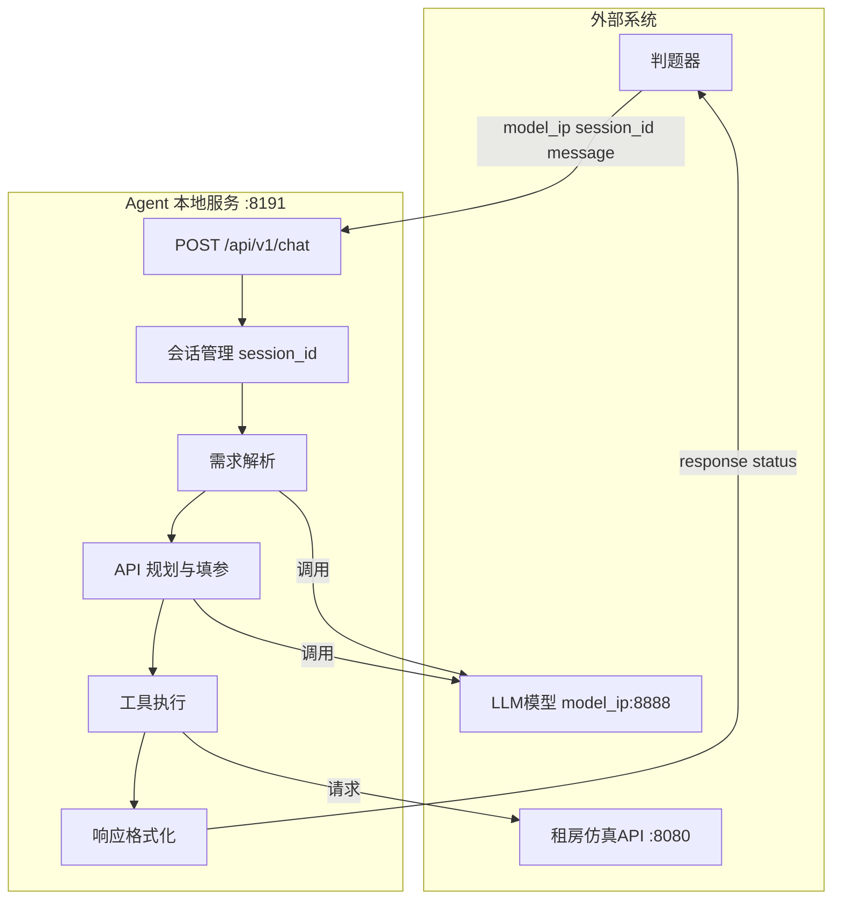
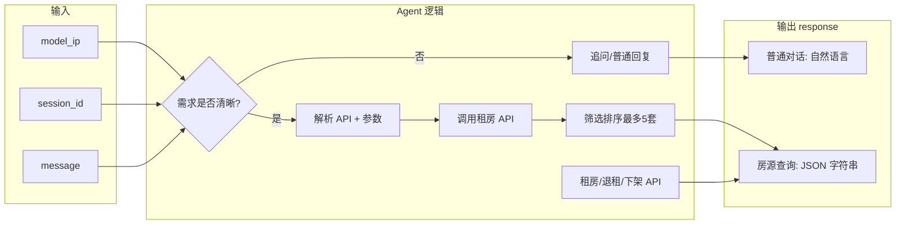

# 租房 AI Agent 赛题解析与本地测试方案

## 一、赛题解析

### 1.1 核心目标

开发一个**智能租房 AI Agent**，实现从用户需求理解到房源推荐的全流程自动化，解决「找房难、耗时长、选不准」的痛点。

### 1.2 评测维度


| 维度     | 说明                                |
| ------ | --------------------------------- |
| 需求理解能力 | 精准提取租金、地段、户型、通勤、配套等多元需求，处理模糊/隐含需求 |
| 自主决策能力 | 自动规划 API 调用链、参数填充、多轮追问            |
| 信息整合能力 | 多平台房源筛选、核验、分类、排序                  |
| 结果输出能力 | 最多 5 套高匹配房源，JSON 格式规范             |


### 1.3 系统架构




### 1.4 数据流与关键规则




**关键规则：**

- **session 级数据重置**：每新起 session 需调用 `POST /api/houses/init`，保证用例可重复执行
- **X-User-ID**：房源相关接口必带，值为用户工号
- **近距离定义**：近地铁 ≤800m，地铁可达 ≤1000m；地标附近默认 2000m
- **租房/退租/下架**：必须调用对应 API，对话中生成「已租」无效

### 1.5 用例类型与积分


| 类型   | 常量     | 积分      | 典型场景                     |
| ---- | ------ | ------- | ------------------------ |
| 聊天类  | Chat   | 5 分     | 基本对话、寒暄                  |
| 单轮简单 | Single | 10-15 分 | 单/多条件查询（区域+户型+装修+地铁+预算等） |
| 多轮复杂 | Multi  | 20-30 分 | 多轮筛选、多平台比价、租房决策、边聊边查     |


---

## 二、解题思路

### 2.1 技术栈建议

- **Web 服务**：FastAPI / Flask，监听 `localhost:8191`
- **LLM 调用**：OpenAI 兼容接口 `POST /v1/chat/completions`，请求头带 `session_id`
- **工具调用**：Function Calling 或 ReAct，将 [租房API接口.json](租房API接口.json) 转为 tools 定义

### 2.2 Agent 核心流程

1. **接收请求** → 解析 `model_ip`、`session_id`、`message`
2. **Session 初始化** → 若为新 session，调用 `POST /api/houses/init`
3. **需求理解** → 调用 LLM，提取：区域、户型、租金、地铁距离、装修、电梯等
4. **API 规划** → LLM 输出需调用的 API 及参数（可多步）
5. **执行查询** → 按规划调用租房 API，带 `X-User-ID`
6. **结果整合** → 筛选、排序，取最多 5 套
7. **输出格式化** → 若为房源查询：`response = JSON.stringify({ message, houses })`

### 2.3 API 调用策略


| 用户需求        | 推荐 API 组合                                                                                     |
| ----------- | --------------------------------------------------------------------------------------------- |
| 区域+户型+价格+地铁 | `/api/houses/by_platform`（district, bedrooms, min_price, max_price, max_subway_dist, sort_by） |
| 某地标附近       | `/api/landmarks/name/{name}` → `/api/houses/nearby`                                           |
| 某小区房源       | `/api/houses/by_community`                                                                    |
| 多平台比价       | 分别调 `listing_platform=链家/安居客/58同城`                                                            |
| 租房操作        | `POST /api/houses/{id}/rent?listing_platform=xxx`                                             |


### 2.4 难点与对策


| 难点   | 对策                                                        |
| ---- | --------------------------------------------------------- |
| 模糊需求 | 设计追问 prompt，引导用户补充区域、预算、户型                                |
| 多轮指代 | 维护 session 内对话历史，LLM 做指代消解                                |
| 排序要求 | 解析「按离地铁从近到远」→ `sort_by=subway_distance`, `sort_order=asc` |
| 租房语义 | 识别「就租这套」→ 调用 rent API，并返回 houses 含该套房                     |


---

## 三、本地测试用例设计

因当前环境无法访问真实租房 API，需构建 **Mock 测试体系**：

### 3.1 测试用例结构

沿用需求说明中的用例格式，扩展为可自动化校验的结构：

```json
{
  "test_id": "TC-001",
  "type": "Single",
  "description": "东城区精装两居无匹配",
  "rounds": [
    {
      "session_id": "EV-43",
      "user_input": "东城区精装两居，租金 5000 以内，离地铁 500 米以内的有吗？",
      "expected": {
        "message_contains": ["没有"],
        "expectedHouses": [],
        "response_is_json": false
      }
    }
  ]
}
```

### 3.2 本地测试用例清单

基于需求说明中的 3 个示例，生成完整测试用例文件：


| 用例 ID  | 类型     | 描述                            | 轮数  |
| ------ | ------ | ----------------------------- | --- |
| TC-001 | Single | 东城区精装两居 5000 以内 500m 地铁 → 无匹配 | 1   |
| TC-002 | Multi  | 西城近地铁一居，按地铁距离排序，多轮追问          | 2   |
| TC-003 | Multi  | 海淀近地铁两居排序 + 租房决策              | 2   |


### 3.3 Mock 方案

**方案 A：Mock HTTP 服务（推荐）**

- 新建 `mock_rental_api.py`，用 `httpx`/`requests` 拦截或 `responses` 库 mock
- 根据请求路径和参数返回预设 JSON（如 HF_13、HF_906 等）
- Agent 配置 `RENTAL_API_BASE_URL=http://localhost:8081` 指向 Mock

**方案 B：Fixture 数据文件**

- 新建 `tests/fixtures/` 目录
- 为每个 API 端点准备 JSON 响应文件，如 `houses_by_platform_haidian_2bed.json`
- 测试时注入这些 fixture 作为 API 返回值

**方案 C：契约测试**

- 仅校验 Agent 发出的 HTTP 请求是否符合接口约定（方法、路径、参数）
- 不依赖真实或 Mock 的响应内容

### 3.4 建议文件结构

```
Rent agent_2/
├── 需求说明.md
├── 租房API接口.json
├── tests/
│   ├── test_cases.json          # 用例定义（含 expected）
│   ├── fixtures/                # Mock 响应
│   │   ├── landmarks/
│   │   └── houses/
│   └── conftest.py              # pytest fixtures，启动 Mock 服务
├── mock_rental_api.py           # Mock 租房 API 服务
└── agent/                       # Agent 实现（待开发）
```

---

## 四、实施步骤

1. **搭建 Agent 骨架**：FastAPI 服务、/api/v1/chat 路由、session 管理
2. **集成 LLM**：封装 model_ip:8888 调用，支持 tools
3. **实现租房 API 客户端**：带 X-User-ID，支持 init/查询/租房
4. **开发 Mock 服务**：按 [租房API接口.json](租房API接口.json) 实现关键端点
5. **编写测试用例**：将 TC-001/002/003 写入 `test_cases.json`
6. **实现测试运行器**：读取用例 → 调用 Agent → 校验 response 与 expectedHouses

---

## 五、附录：测试用例 JSON 示例

以下为基于需求说明生成的 `test_cases.json` 结构示例（完整内容见交付文件）：

```json
[
  {
    "test_id": "TC-001",
    "type": "Single",
    "rounds": [{
      "session_id": "EV-43",
      "user_input": "东城区精装两居，租金 5000 以内，离地铁 500 米以内的有吗？",
      "expected": {
        "message_contains": ["没有"],
        "expectedHouses": []
      }
    }]
  },
  {
    "test_id": "TC-002",
    "type": "Multi",
    "rounds": [
      {
        "session_id": "EV-46",
        "user_input": "西城区离地铁近的一居室有吗？按离地铁从近到远排。",
        "expected": {
          "message_contains": ["西城", "1", "1000", "subway_distance", "asc"],
          "expectedHouses": ["HF_13"]
        }
      },
      {
        "session_id": "EV-46",
        "user_input": "还有其他的吗？把所有符合条件的都给出来",
        "expected": {
          "message_contains": ["没有其他的了", "只有这一套"],
          "expectedHouses": ["HF_13"]
        }
      }
    ]
  },
  {
    "test_id": "TC-003",
    "type": "Multi",
    "rounds": [
      {
        "session_id": "EV-45",
        "user_input": "海淀区离地铁近的两居有吗？按离地铁从近到远排一下。",
        "expected": {
          "message_contains": ["海淀", "2", "800", "subway_distance", "asc"],
          "expectedHouses": ["HF_906", "HF_1586", "HF_1876", "HF_706", "HF_33"]
        }
      },
      {
        "session_id": "EV-45",
        "user_input": "就租最近的那套吧。",
        "expected": {
          "message_contains": ["好的"],
          "expectedHouses": ["HF_906"]
        }
      }
    ]
  }
]
```

**校验逻辑说明：**

- `message_contains`：response（或 JSON 内 message）需包含这些关键词（用于验证查询条件理解）
- `expectedHouses`：房源查询场景下，`houses` 数组需与之一致（顺序可考虑放宽）
- 租房场景：第二轮需调用 rent API，且 `expectedHouses` 为最终租赁的那一套

